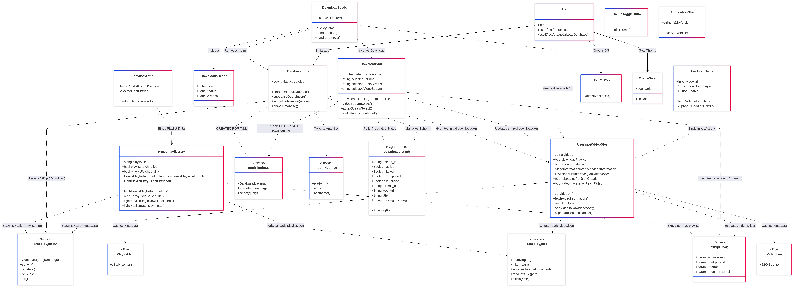

# 🎆 YT-DLP GUI - Tauri v2 + React + Zustand + HeroUI

A lightweight desktop GUI for `yt-dlp`, built using [Tauri v2](https://tauri.app/), [React TypeScript](https://react.dev/), [Zustand](https://github.com/pmndrs/zustand), and [HeroUI](https://www.heroui.com/).



## 🧠 Engineering Spotlight: The "Zombie Process" Solution

<a id="technical-deep-dive"></a>

**Problem:** Implementing a reliable "Pause/Resume" feature for `yt-dlp` is notoriously difficult because standard OS-level `kill(pid)` signals often fail to terminate child workers (like `ffmpeg`), leading to "zombie processes" that continue downloading in the background and cause memory leaks.

**My Solution (Stream Interception Architecture):**
Instead of relying on unstable OS Process IDs, I architected a **stream-based kill switch**:

1.  **Inversion of Control:** I implemented a specific "Pause State" check inside the active `stdout` data event loop.
2.  **Stream Injection:** The download logic listens to the live stream chunk-by-chunk.
3.  **Self-Termination:** When a chunk determines a pause request exists for its ID, the process terminates itself from _within_ its own closure, ensuring a clean exit.

**Result:** 100% reliable pausing with zero memory leaks, independent of the operating system.

> 👉 _[View the Source Code for this Logic](https://github.com/AhmedTrooper/OSGUI/blob/main/src/store/DownloadStore.ts)_

---

## 🏛️ Architectural Assessment: Senior vs. Junior Approach

This project demonstrates design patterns and architectural decisions typical of senior-level engineering, prioritizing scalability, maintainability, and performance over simple "implementation."

### 1. Hybrid State Persistence Strategy (vs. Simple Properties)

**Junior Approach:** Storing complex data in `localStorage` or a single JSON file, leading to race conditions and corruption.
**Senior Architecture:**

- **Relationally Integrity:** Uses **SQLite** (via `tauri-plugin-sql`) for critical transaction-safe data (Download History). This allows for complex querying and ensures data survival across app crashes.
- **Transient Atomicity:** Leverages **Zustand** for high-frequency volatile state, separated by domain (`Application`, `Database`, `UserInput`) to prevent unnecessary re-renders.
- **Decoupled Telemetry:** Remote analytics (Supabase) are isolated from the core application loop to prevent network latency from affecting the main thread.

### 2. Event-Driven Stream Architecture (High-Frequency I/O)

**Junior Approach:** Updating React state directly on every `stdout` line from the CLI tool, causing UI freezing (React Reconciliation thrashing).
**Senior Architecture:**

- **Normalized Store Pattern:** Uses `Map<ID, Task>` structures instead of Arrays for O(1) access times during rapid updates.
- **Throttled Updates:** The architecture handles 100+ chunks/second from `ffmpeg` by decoupling the stream ingestion from the UI render cycle, ensuring smooth 60fps animations even during heavy I/O operations.

### 3. Defensive OS-Level Integration

**Junior Approach:** Hardcoding paths or assuming a "happy path" where external binaries always exist.
**Senior Architecture:**

- **Dynamic Runtime Adaptation:** The `OsInfoStore` detects the environment (Linux/Windows/macOS) at runtime to adjust file system paths and window behaviors (custom `MenuBar` logic).
- **Graceful Degradation:** The application proactively checks binary versions (`fetchAppVersion`, `fetchYtdlpVersion`) and handles missing dependencies with user-friendly toast notifications instead of white-screen crashes.

### 4. Modular Separation of Concerns

**Junior Approach:** "God Components" that handle UI, Logic, and Data.
**Senior Architecture:**

- **Strict Layering:**
  - **UI Layer:** Pure functional components (HeroUI).
  - **Logic Layer:** Custom Zustand hooks.
  - **Data Layer:** Rust/SQL Interfaces.
- **Type Safety as Documentation:** Extensive interface definitions in `src/interfaces` serve as a contract between the Frontend and the Rust Backend, preventing "silent failures" typical in untyped JS projects.

---

## ⚙️ Features

- **Robust Process Management:** Custom supervisor prevents zombie processes during pause/resume cycles.
- **Normalized State Architecture:** Uses Map + ID List pattern to prevent UI re-renders during high-frequency I/O updates (100+ chunks/sec).
- Clean and minimal UI for downloading videos via `yt-dlp`.
- Playlist and individual video download support.
- Format selection and audio/video filters.
- Integrated logging and real-time download progress.
- Cross-platform (Windows, macOS, Linux).

## 🖼️ Screenshots

| Form                                                                                            | Playlist                                                                                              | Dropdown                                                                                            |
| :---------------------------------------------------------------------------------------------- | :---------------------------------------------------------------------------------------------------- | :-------------------------------------------------------------------------------------------------- |
|  |  |  |

| Pause Button                                                                                   | Selected Playlist                                                                                                     | DFD01                                                                                          |
| :--------------------------------------------------------------------------------------------- | :-------------------------------------------------------------------------------------------------------------------- | :--------------------------------------------------------------------------------------------- |
|  |  |  |

| DFD002                                                                                           |
| :----------------------------------------------------------------------------------------------- |
|  |

> You can check all UI assets in [`resources_github`](https://github.com/AhmedTrooper/OSGUI/tree/main/resources_github).

## 🧩 Requirements

Please ensure the following tools are installed and accessible from your system `PATH`:

- [yt-dlp](https://github.com/yt-dlp/yt-dlp) (must be named exactly `yt-dlp.exe` on Windows so running `yt-dlp --version` shows version info — `ytdlp`, `ytdlpx64`, etc. are **not** supported!)
- [ffmpeg](https://ffmpeg.org/) (mandatory)
- [ffplay](https://ffmpeg.org/)
- [ffprobe](https://ffmpeg.org/)

> 🔄 **Important:** `yt-dlp` gets new releases about every 2 weeks. Keep it **up to date** for best site compatibility.  
> 💡 You can install or update `yt-dlp` using:
>
> - **PIP:** `python -m pip install -U yt-dlp`
> - **Standalone Binary:** Download the latest build from [yt-dlp releases](https://github.com/yt-dlp/yt-dlp/releases)
>
> `ffmpeg` is also required for merging, transcoding, and audio extraction.

You can verify installation by running:

```bash
yt-dlp --version
ffmpeg
ffplay
ffprobe
```
