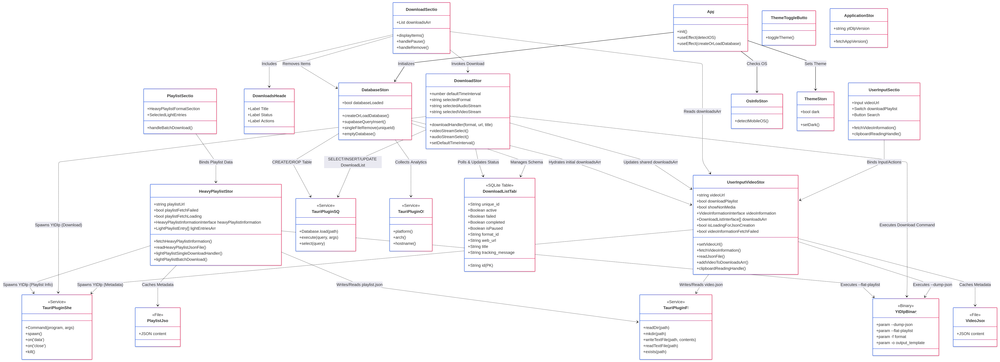
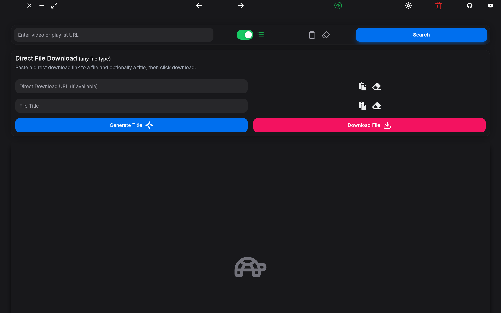
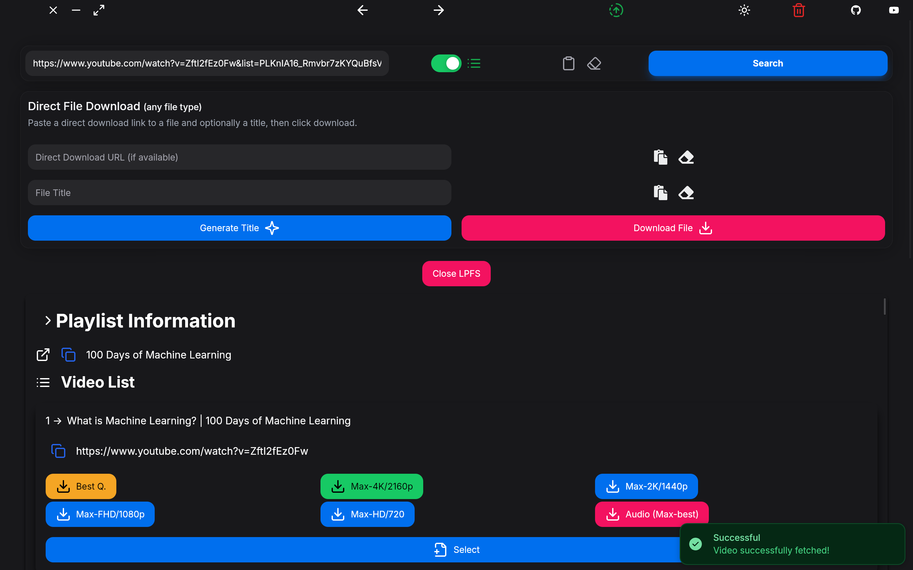
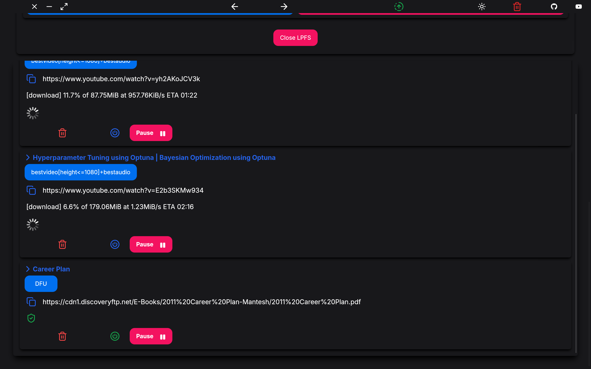
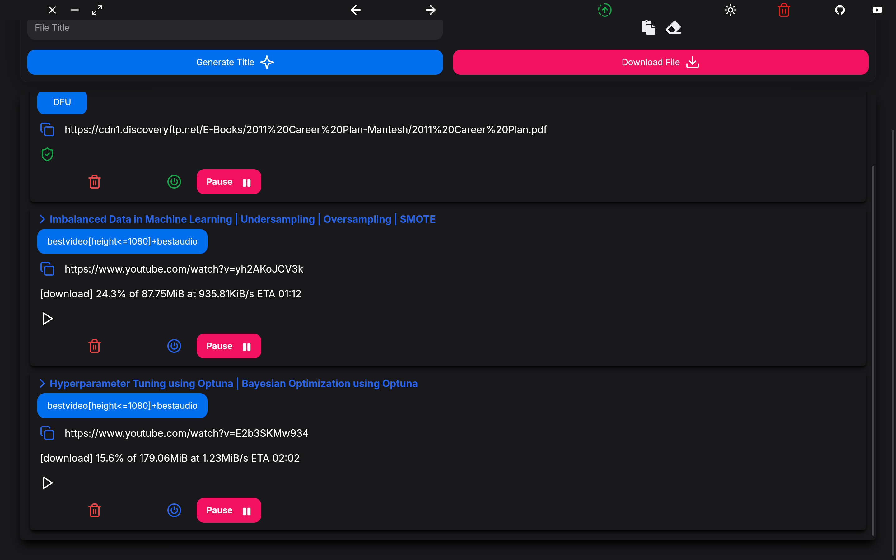
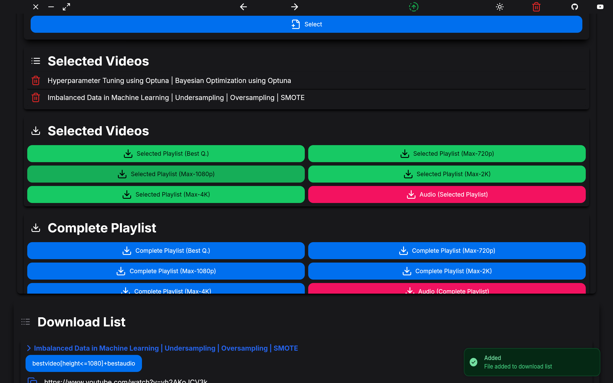
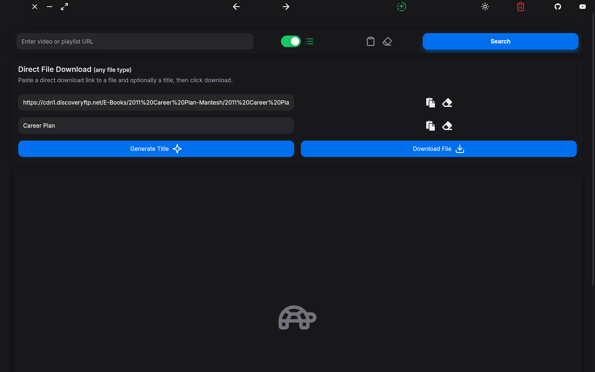
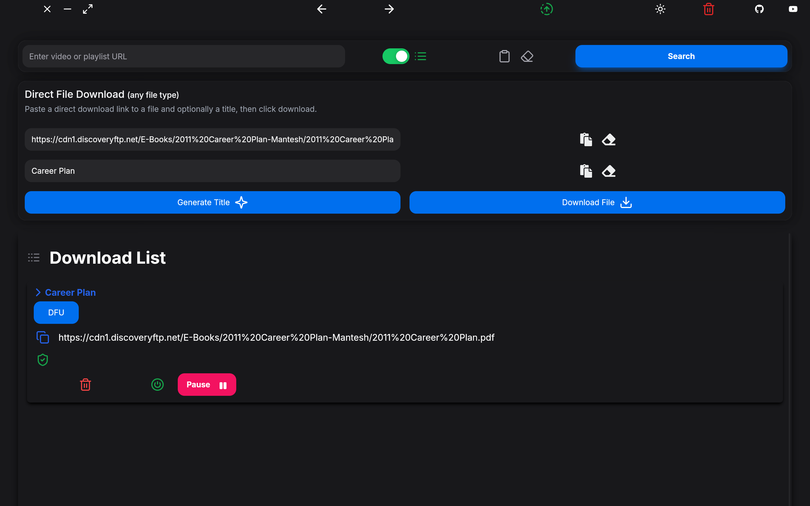

# OSGUI Runtime Architecture Guide


This document is the technical architecture reference for OSGUI. It explains how the system executes commands, manages process lifecycle, persists and parses JSON, applies interface contracts, and stays stable under massive concurrency.

## 30-Second Executive Pitch

OSGUI is a desktop-grade download orchestration system built with Tauri + React, designed for high-concurrency media workflows.

What makes it stand out:
- Concurrency-safe runtime architecture for large parallel download loads.
- Queue-based pause/kill semantics for deterministic process control.
- Non-reactive buffering plus 1-second batched persistence to protect UI performance.
- SQLite-backed source-of-truth state model with typed contracts.
- Virtualized rendering strategy for large task lists.

Bottom line:
- This project demonstrates senior-level systems thinking applied to a real product surface.

## 2-Minute Technical Deep Dive

Problem addressed:
- Streaming process output can emit thousands of events per second under heavy parallelism.
- Directly writing every event into reactive UI state and DB can cause render thrash and instability.

Architecture decisions:
1. Event ingestion is separated from rendering using a local nonReactiveDownloadStore map keyed by unique_id.
2. Pause control uses a queue (not a single variable), so multiple user pause requests are preserved and processed deterministically.
3. A global 1-second scheduler flushes buffered state into SQLite in batches.
4. Reactive store reads from DB snapshots, keeping UI updates predictable.
5. Large lists are rendered with viewport virtualization to avoid mounting all rows.

Resulting behavior:
- Better throughput under concurrency.
- Reduced UI churn and improved responsiveness.
- More stable state transitions across active, paused, failed, and completed tasks.

## Recruiter-Facing Engineering Highlights

- Designed and implemented a concurrency-safe runtime model for desktop media orchestration.
- Applied batching and non-reactive buffering patterns to prevent UI collapse under high-frequency event streams.
- Introduced queue-based pause control to support reliable multi-task interruption semantics.
- Enforced typed contracts across runtime boundaries to reduce integration risk and improve long-term maintainability.
- Structured the rendering layer around viewport virtualization to sustain UI responsiveness with very large datasets.

## Seniority Signal Ranking

This implementation demonstrates strong senior-level engineering signals when evaluated by system-design, runtime reliability, and frontend performance criteria.

1. Concurrency architecture and backpressure control: staff-level signal.
2. Deterministic process lifecycle and queue-driven pause semantics: senior-level signal.
3. Decoupled reactive/non-reactive state boundaries: senior-level signal.
4. Durable state strategy with typed contracts and DB source-of-truth: senior-level signal.
5. Large-list rendering strategy using viewport virtualization: senior-level signal.

Hiring takeaway:
- This is not only feature-complete logic; it reflects production-grade load thinking, failure-mode design, and maintainable architecture boundaries.

## Technical Appendix

## Tech Stack

Core framework and runtime:
- Tauri v2
- React 18 + TypeScript
- Vite 6

State and UI:
- Zustand
- HeroUI
- Tailwind CSS
- Lucide React and React Icons

Platform and persistence:
- yt-dlp (external binary)
- ffmpeg / ffplay / ffprobe
- SQLite via @tauri-apps/plugin-sql
- Tauri shell, fs, os, clipboard plugins

Additional tooling:
- nanoid
- lodash
- Supabase JS (telemetry integration hook)

## Setup Guide

### ✅ Minimal User Setup

For normal users, no development setup is required.

1. 📦 Download the OSGUI binary from the GitHub Releases section.
2. 🧩 Ensure these two tools are installed and available in PATH:
- 🎯 `yt-dlp` (must be available in PATH)
- 🎯 `ffmpeg` (must be available in PATH)

That is all you need to run OSGUI.

### 🔍 Verify Installation

```bash
yt-dlp --version
ffmpeg
```

## Executive Summary

OSGUI uses a high-throughput, event-ingestion architecture designed for real-world workloads, including large playlists and highly concurrent downloads.

Key properties:
- Queue-based pause orchestration for reliable multi-click pause handling.
- Non-reactive stream buffering to isolate high-frequency shell events from React rendering.
- Global 1-second flush cadence to batch writes into SQLite and avoid render storms.
- DB-backed reactive state to keep UI deterministic and crash-resistant.
- Viewport virtualization so only visible list rows render, even with very large download sets.

This architecture is intentionally designed as production behavior, not a prototype pattern.

## Architecture Diagram (Mermaid)



## 🖼️ UI Screenshots

| Form | Playlist | Dropdown |
| :--- | :--- | :--- |
|  |  |  |

| Pause Button | Selected Playlist | DFD01 |
| :--- | :--- | :--- |
|  |  |  |

| DFD002 |
| :--- |
|  |

## 1) System Runtime Topology

Boot path:
1. src/main.tsx initializes React, providers, and routing.
2. src/App.tsx initializes OS detection, theme, SQLite loading, and version checks.
3. src/routes/Home.tsx loads src/components/video/VideoContainer.tsx.
4. VideoContainer composes video input, direct download input, metadata sections, playlist sections, and download list.

Separation of concerns:
- UI layer: thin, declarative components.
- Orchestration layer: Zustand stores in src/store.
- Runtime layer: Tauri shell/fs/path/sql/app/os plugins.
- Persistence layer: SQLite for durable download state.

## 2) Command Execution Model

All external execution uses Tauri shell command wrappers around yt-dlp.

Core command families:
- Metadata discovery (single video and playlist metadata extraction).
- Download execution (single video, playlist entries, direct-file mode).
- Environment/version probing (yt-dlp version checks).

Execution lifecycle:
1. Command created.
2. Child process spawned.
3. stdout/stderr events captured into non-reactive in-memory buffers.
4. Close event finalizes outcome state.

## 3) High-Concurrency Stream Strategy

### 3.1 Why direct reactive updates are avoided

If 1000 concurrent downloads emit 10 events/second each, the system can receive ~10,000 stream events per second. Updating React state and DB on every event causes unnecessary work, UI thrashing, and instability.

### 3.2 nonReactiveDownloadStore

A local non-reactive store is used to absorb high-frequency stream output.

Design:
- Structure: map keyed by generated unique_id.
- Purpose: hold latest stream snapshots and transient task-state changes.
- Behavior: updates are cheap in-memory writes, not UI-triggering reactive writes.

Result:
- Event ingestion remains fast.
- React render pressure stays bounded.
- DB operations are decoupled from event frequency.

### 3.3 Global 1-second flush tick

A global scheduler flushes buffered state every 1 second.

Per tick responsibilities:
1. Read buffered entries from nonReactiveDownloadStore.
2. Batch-apply updates to SQLite DownloadList.
3. Sync reactive download store from DB snapshot.
4. Clear/advance buffer state for next interval.

Benefits:
- Predictable write volume.
- Controlled render cadence.
- Better performance at scale.

## 4) Pause/Kill Management (Queue-Based)

### 4.1 Pause queue model

Pause requests are managed by a queue of unique download ids, not a single variable.

Why queue-based control matters:
- Multiple rapid pause clicks are preserved.
- Requests are not overwritten by later clicks.
- Pause intent is processed deterministically.

### 4.2 Pause flow

1. User clicks pause on one or more tasks.
2. Each task id is appended to pause queue.
3. Stream-processing loop checks queue membership per task id.
4. Matching process is marked paused and child process is killed.
5. Outcome is reflected in buffered state, then persisted on next global tick.

### 4.3 Kill semantics

Process termination is explicit and task-scoped.
- Kill is applied to the child process bound to matching unique_id.
- Final status is persisted as paused/failed/completed based on terminal state rules.

## 5) Durable State and DB Synchronization

Primary durable store: SQLite database file sqlite:osgui.db.

DownloadList tracks lifecycle flags and metadata, including:
- active
- failed
- completed
- isPaused
- tracking_message
- format_id
- title
- url and playlist context

Synchronization model:
- Runtime events -> nonReactiveDownloadStore map.
- Global tick -> batched DB writes.
- Reactive store -> refreshed from DB snapshot.
- UI -> renders reactive snapshot only.

This avoids high-frequency direct render coupling.

## 6) JSON Lifecycle (Saved, Accessed, Parsed)

JSON persistence directory:
- Documents/OSGUI

Files:
- video.json for mixed metadata discovery flow.
- playlist.json for dedicated playlist metadata flow.

Lifecycle:
1. Metadata command emits JSON text.
2. JSON is written to file in OSGUI folder.
3. Reader validates file existence.
4. Parser branches by payload shape:
    - entries array -> playlist model.
    - formats array -> single video model.
5. Parsed object is mapped into typed store state.

## 7) Interface Contract Layer

Interfaces in src/interfaces provide strict contracts across UI, stores, and persistence.

Primary contract groups:
- video contracts: metadata payloads, format entries, download tile state.
- playlist contracts: playlist payloads, light/heavy entries, quality enums.
- store contracts: state/actions for user input, downloads, playlists, database, and app metadata.

Why this matters:
- Safer refactors.
- Explicit boundaries between modules.
- Improved maintainability and onboarding speed.

## 8) Massive List Rendering Strategy

The download list uses viewport virtualization to render only visible rows.

Behavior:
- Thousands of tasks can exist in memory/DB.
- Only viewport slice is mounted in React tree.
- Scroll window updates rendered slice incrementally.

Outcome:
- Lower memory pressure.
- Stable frame times.
- No full-list re-render cost for large queues.

## 9) End-to-End Lifecycle Examples

### 9.1 Single Video

1. Input URL.
2. Fetch metadata command executes.
3. JSON is saved and parsed.
4. User chooses format and starts download.
5. Stream events enter nonReactiveDownloadStore.
6. 1-second tick batches to DB.
7. UI updates from DB-backed reactive state.
8. Task ends as completed/failed/paused.

### 9.2 Heavy Playlist

1. Input playlist URL.
2. Playlist metadata command executes.
3. playlist.json parsed into entry list.
4. User starts single or batch downloads.
5. Each task follows same buffered stream pipeline.
6. Pause queue supports multi-task pause requests safely.
7. Virtualized list keeps UI responsive at scale.

## 10) Operational Quality Notes

- This architecture prioritizes deterministic state transitions under load.
- Event ingestion and rendering are intentionally decoupled.
- DB remains source of truth for reactive UI snapshots.
- Queue-based control eliminates single-variable pause race behavior.

## 11) Interface Snapshots (Type Contracts)

Representative interface patterns used in the codebase:

```ts
export interface VideoInformationInterface {
   format_id?: string | null;
   format?: string | null;
   title?: string | null;
   webpage_url?: string | null;
   formats: FormatInterface[];
}

export interface FormatInterface {
   format_id: string | null;
   acodec?: string | "none" | null;
   vcodec?: string | "none" | null;
   ext?: string | null;
   resolution?: string;
   filesize_approx?: number | null;
}
```

```ts
export interface SingleVideoTileInterface {
   unique_id: string;
   active: boolean;
   failed: boolean;
   completed: boolean;
   isPaused: pauseStatus;
   format_id: string;
   web_url?: string | null;
   title: string | null;
   tracking_message: string;
   playlistVerification: string;
   playlistTitle: string;
}
```

```ts
export interface HeavyPlaylistInformationInterface {
   channel: string;
   channel_url: string;
   uploader_url: string;
   webpage_url: string;
   entries: HeavyPlaylistEntry[];
   title: string;
}

export interface LightPlaylistEntry {
   url: string;
   title: string;
}
```

## 12) Core Runtime Structures

### 12.1 Non-reactive stream buffer

```ts
type TaskId = string;

interface StreamSnapshot {
   trackingMessage: string;
   active: boolean;
   failed: boolean;
   completed: boolean;
   isPaused: boolean;
   updatedAtMs: number;
}

type NonReactiveDownloadStore = Map<TaskId, StreamSnapshot>;
```

### 12.2 Pause queue

```ts
type PauseQueue = TaskId[];

// enqueue on pause click
pauseQueue.push(uniqueId);

// dequeue/consume in stream processing pipeline
const shouldPause = pauseQueue.includes(uniqueId);
```

### 12.3 Flush scheduler contract

```ts
interface FlushScheduler {
   intervalMs: number; // 1000
   flush: () => Promise<void>;
}
```

## 13) Representative Code Flow

### 13.1 Command ingestion to buffered state

```ts
const cmd = Command.create("ytDlp", args);
const child = await cmd.spawn();

cmd.stdout.on("data", (chunk) => {
   nonReactiveDownloadStore.set(uniqueId, {
      trackingMessage: chunk.toString().trim(),
      active: true,
      failed: false,
      completed: false,
      isPaused: false,
      updatedAtMs: Date.now(),
   });
});

cmd.stderr.on("data", () => {
   nonReactiveDownloadStore.set(uniqueId, {
      trackingMessage: "Error occurred!",
      active: false,
      failed: true,
      completed: false,
      isPaused: false,
      updatedAtMs: Date.now(),
   });
});
```

### 13.2 Queue-driven pause kill handling

```ts
if (pauseQueue.includes(uniqueId)) {
   nonReactiveDownloadStore.set(uniqueId, {
      trackingMessage: "Paused by user",
      active: false,
      failed: false,
      completed: false,
      isPaused: true,
      updatedAtMs: Date.now(),
   });

   await child.kill();
}
```

### 13.3 1-second global flush

```ts
setInterval(async () => {
   for (const [id, snapshot] of nonReactiveDownloadStore.entries()) {
      await db.execute(
         `UPDATE DownloadList
          SET tracking_message = $1,
                active = $2,
                failed = $3,
                completed = $4,
                isPaused = $5
          WHERE unique_id = $6`,
         [
            snapshot.trackingMessage,
            snapshot.active,
            snapshot.failed,
            snapshot.completed,
            snapshot.isPaused,
            id,
         ],
      );
   }

   const latest = await db.select("SELECT * FROM DownloadList ORDER BY id DESC");
   useUserInputVideoStore.getState().setDownloadsArr(latest);
}, 1000);
```

---

For deeper documentation split options:
1. Runtime internals (process + queue + scheduler).
2. Frontend performance notes (virtualization + render budget).
3. Data contracts and persistence reference (interfaces + SQLite + JSON schema).
